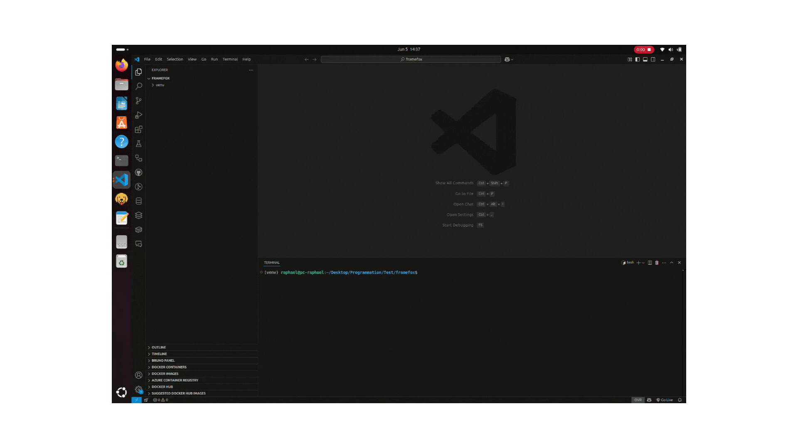

<div align="center">


# 🦊 Framefox
### *Swift, smart, and a bit foxy!*

**The Python web framework that makes development enjoyable and productive**

[](https://python.org)
[](https://opensource.org/licenses/MIT)
[](https://fastapi.tiangolo.com)
[](https://sqlmodel.tiangolo.com)
[](https://docs.pydantic.dev)

[🚀 Quick Start](#-quick-start) • 
[📖 Documentation](https://soma-smart.github.io/framefox/) • 
[🎯 Examples](#-examples) • 
[💬 Contact](#-contact) • 
[🤝 Contributing](#-contributing)

</div>

---

## 🌟 **Why Framefox?**

**Framefox** combines the **speed of FastAPI** with **clean MVC architecture**, **type-safe SQLModel**, **robust Pydantic validation**, and **developer-friendly tooling**. Built for developers who want to ship fast without sacrificing code quality.

### ✨ **What makes it special?**

🎯 **MVC Architecture** - Clean separation with Controllers, Templates, and Repositories  
🏗️ **Interactive CLI** - Generate components instantly with `framefox create`  
⚡ **FastAPI Foundation** - Built on FastAPI with async support out of the box  
🗄️ **SQLModel Integration** - Type-safe database models with automatic validation  
📋 **Pydantic Validation** - Robust data validation and serialization everywhere  
🔒 **Security First** - CSRF protection, XSS prevention, and secure authentication  
🧠 **Developer Friendly** - Jinja2 templates, hot reload, and comprehensive debugging  
📱 **Modern Stack** - Python 3.12+, async/await, dependency injection everywhere  

### Un petit mot en français 

**Framefox est bien un outils de l'hexagone 🇫🇷 N'hesitez pas à communiquer avec nous directement en français pour toute questions (de préférence sur linkedin).
Une version de la documentation en français est également prévu !**

---


## 🚀 **Quick Start**

Get a full web application running in **30 seconds**:

```bash
# Install Framefox
pip install framefox

# Init your project
framefox init

# Start developing
framefox run
```

**That's it!** 🎉 Your app is running on `http://localhost:8000`


---

## 🎯 **Examples**

### 💨 **Controllers with Routes**
```python
from framefox.core.routing.decorator.route import Route
from framefox.core.controller.abstract_controller import AbstractController

class UserController(AbstractController):
    
    @Route("/users", "user.index", methods=["GET"])
    async def index(self):
        users = await self.user_repository.find_all()
        return self.render("user/index.html", {"users": users})
    
    @Route("/users/{id}", "user.show", methods=["GET"])
    async def show(self, id: int):
        user = await self.user_repository.find(id)
        return self.render("user/show.html", {"user": user})
```

### 🎨 **Jinja2 Templates with Built-in Functions**
```html
<!-- templates/user/index.html -->
<!DOCTYPE html>
<html>
<head>
    <title>Users</title>
    <link href="{{ asset('css/app.css') }}" rel="stylesheet">
</head>
<body>
    <h1>Users</h1>
    
    
        <div class="user-card">
            <h3>{{ user.name }}</h3>
            <a href="{{ url_for('user.show', id=user.id) }}">View Profile</a>
        </div>
    
</body>
</html>
```


## 🏗️ **Architecture That Scales**

```
my-project/
├── src/
│   ├── 🎮 controllers/     # Handle HTTP requests and business logic
│   ├── 🏛️ entity/          # Database models and entities  
│   ├── 📝 form/           # Form types and validation
│   └── 🗄️ repository/     # Data access layer
├── 🎨 templates/          # Jinja2 templates with template inheritance
├── ⚙️ config/             # YAML configuration files
├── 🌐 public/            # Static assets (CSS, JS, images)
└── 📋 main.py            # Application entry point
```

**Clean MVC separation** means your code stays **maintainable** as your team and project grow.


## 🔥 **Core Features**

<table>
<tr>
<td width="50%">

### 🚄 **Performance**
- FastAPI foundation
- Async/await support
- Built-in template caching
- Dependency injection container
- Repository pattern for data access

### 🛡️ **Security**
- CSRF token generation
- XSS prevention in templates
- Secure session management
- User authentication system
- Role-based access control

</td>
<td width="50%">

### 🧰 **Developer Experience**
- Interactive CLI commands
- Component generators
- Hot reload development server
- Comprehensive error pages
- Built-in profiler and debugger

### 🗃️ **Database & ORM**
- SQLModel integration for type safety
- Pydantic validation everywhere
- Entity-Repository pattern
- Database migrations with Alembic
- Relationship mapping
- Query builder integration
- Multi-database support

</td>
</tr>
</table>

---

## 🛠️ **Interactive CLI**

Framefox includes a powerful CLI for rapid development:

```bash
# Generate components instantly
framefox create controller
framefox create entity
framefox create crud       # Full CRUD with templates

# Database management
framefox database create-migration
framefox database upgrade

# Development tools
framefox server              # Start development server
framefox debug router       # List all routes
framefox cache clear        # Clear application cache

```

---

## 🎨 **Template System**

Framefox uses **Jinja2** with powerful built-in functions:

### 🔧 **Built-in Template Functions**
- `{{ url_for('route.name', param=value) }}` - Generate URLs from route names
- `{{ asset('path/file.css') }}` - Asset management with versioning
- `{{ csrf_token() }}` - CSRF protection
- `{{ current_user }}` - Access authenticated user
- `{{ get_flash_messages() }}` - Session-based notifications

### 🏗️ **Template Inheritance**
```html
<!-- base.html -->
<!DOCTYPE html>
<html>
<head>
    <title>My App</title>
    <link href="{{ asset('css/app.css') }}" rel="stylesheet">
</head>
<body>
    <nav>
        <!-- Navigation with authentication -->
        
            <span>Welcome, {{ current_user.name }}!</span>
        
    </nav>
    
    <main>
        
    </main>
</body>
</html>
```

---


## 📚 **Learn More**

| 📖 **Resource**                                                                      | 🎯 **Perfect For**               |
| ----------------------------------------------------------------------------------- | ------------------------------- |
| [📋 Installation Guide](https://soma-smart.github.io/framefox/docs/installation) | Getting up and running          |
| [🎮 Controllers Guide](https://soma-smart.github.io/framefox/docs/controllers)   | Building your application logic |
| [🎨 Templates Guide](https://soma-smart.github.io/framefox/docs/templates)       | Creating beautiful views        |
| [🔐 Security Guide](https://soma-smart.github.io/framefox/docs/security)         | Securing your application       |
| [🧪 Testing Guide](https://soma-smart.github.io/framefox/docs/testing)           | Writing comprehensive tests     |
| [🚀 Deployment Guide](https://soma-smart.github.io/framefox/docs/deployment)     | Going to production             |


## 💬 **Contact**

<div align="center">

[](https://www.linkedin.com/company/soma-smart)

**Need help or have questions? Contact us directly!**

</div>

- 💼 **Company LinkedIn**: [SOMA Smart](https://www.linkedin.com/company/soma-smart)
- 👤 **Rayen BOUMAZA**: [LinkedIn](https://www.linkedin.com/in/rayen-boumaza)
- 👤 **Raphaël LEUROND**: [LinkedIn](https://www.linkedin.com/in/raphael-leurond)
- 📖 **Documentation**: [soma-smart.github.io](https://soma-smart.github.io/framefox/)

---

## 🤝 **Contributing**

We ❤️ contributors! Here's how you can help:

### 🆕 **For New Contributors**
1. 🍴 Fork the repository
2. 🌿 Create a feature branch: `git checkout -b feature/amazing-feature`
3. 💾 Commit your changes: `git commit -m 'Add amazing feature'`
4. 📤 Push to the branch: `git push origin feature/amazing-feature`
5. 🔄 Open a Pull Request

### 🎯 **Good First Issues**
- 📝 Improve documentation
- 🐛 Fix small bugs
- ✨ Add examples
- 🧪 Write tests

For any questions about contributing, feel free to contact us directly on LinkedIn!

---

## 🏆 **Support the Project**

If Framefox helps you build amazing things:

⭐ **Star this repository**  
🐦 **Share on social media**  
📝 **Write a blog post**  
🔗 **Share with friends**  

Your support means the world to us! 🙏
---

## 🛣️ **Roadmap**

<div align="center">

### 🚧 **What's Coming Next**

*Framefox is actively developed with exciting features on the horizon!*

</div>

### **In Progress**
- **Advanced Testing Suite** - Built-in testing utilities and fixtures (we know Framefox lack of more tests)
- **Internationalization (i18n)** - Multi-language support with automatic translation management
- **WebSocket Support** - Real-time features with integrated WebSocket handling
- **Enhanced Profiler** - Advanced performance monitoring and optimization tools
- **Better Security control** - Role Hierachy, rate limiting, Security Header configuration
- **Functional Worker** - Background task with a command to generation task


### 🚀 **Future Vision**
- ☁️ **Cloud Deploy Tools** - Built-in deployment to AWS, GCP, and Azure
- 🎨 **Visual Admin Panel** - Auto-generated admin interface for your models
- 📱 **Mobile API Generator** - Automatic REST API generation for mobile apps


### 🇫🇷 **Documentation française**

- 📚 **Documentation complète en français** - Guide complet et tutoriels
- 🎥 **Tutoriels vidéo** - Série de vidéos explicatives

---

### 📢 **Want to Influence the Roadmap?**

<div align="center">

Your feedback shapes Framefox's future! Contact us on LinkedIn to:

- 💡 **Suggest** new ideas  
- 🤝 **Collaborate** on development
- 🧪 **Beta test** upcoming features
- 🗳️ **Vote** on priority features (maybe!)

[](https://www.linkedin.com/company/soma-smart)

</div>


## 👥 **Core Team**

<div align="center">

### 🏢 **Backed by SOMA Smart**

[](https://soma-smart.com)

*Framefox is proudly backed by **SOMA Smart**, a technology company focused on data transformation and building innovative development tools.*

|  |  |
| :------------------------------------------------: | :---------------------------------------------------: |
|  **[Rayen BOUMAZA](https://www.linkedin.com/in/rayen-boumaza)**  |  **[Raphaël LEUROND](https://www.linkedin.com/in/raphael-leurond)**  |
|               *Framework Architect*                |                   *Core Developer*                    |
|            🏗️ Architecture & Performance            |                   🔧 Features & DevX                   |

---

### 🌟 **About SOMA Smart**

**SOMA Smart** is committed to **empowering developers** with cutting-edge tools and frameworks. Framefox represents our vision of making Python web development more **productive**, **secure**, and **enjoyable**.

- 🚀 **Innovation-driven** development approach
- 🔧 **Open-source** commitment and community focus  
- 🌍 **Global** team of passionate developers
- 📈 **Long-term** support and continuous improvement

[**Learn more about SOMA Smart →**](https://soma-smart.com)

</div>
---

<div align="center">

### 🦊 **Swift, smart, and a bit foxy!**

**Framefox makes Python web development enjoyable and productive.**

⭐ **[Star us on GitHub](https://github.com/soma-smart/framefox)** ⭐

</div>

## 📄 **License**

This project is licensed under the **MIT License** - see the [LICENSE](./LICENSE) file for details.

