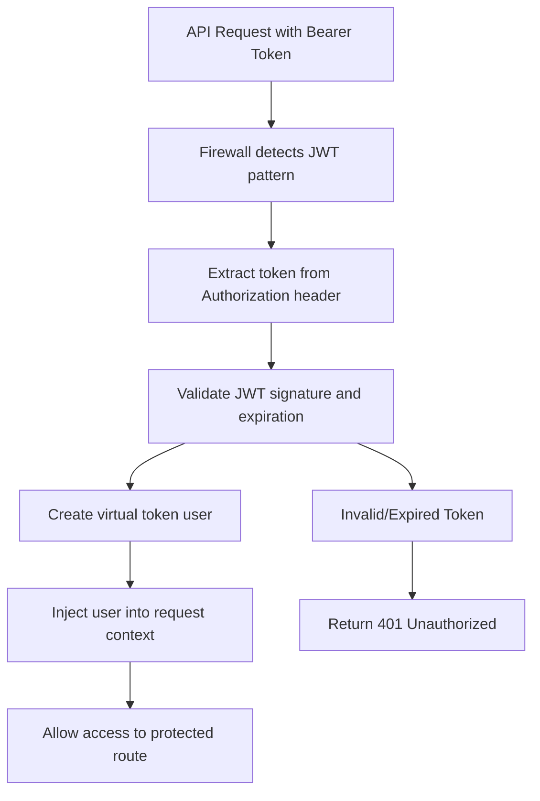

JWT (JSON Web Token) authentication in Framefox represents a paradigm shift from traditional session-based authentication to a stateless, distributed authentication model that's perfectly suited for modern web applications, APIs, and microservices architectures.

Unlike session-based authentication that requires server-side storage and creates scaling challenges, JWT authentication enables truly stateless applications where authentication information is encoded directly into cryptographically signed tokens. This approach eliminates the need for centralized session storage, making it ideal for horizontally scaled applications and cross-domain authentication scenarios.

:::note[JWT Security Standards & Best Practices]
Framefox JWT implementation follows [RFC 7519 (JWT)](https://tools.ietf.org/html/rfc7519) and [RFC 7515 (JWS)](https://tools.ietf.org/html/rfc7515) specifications, with security practices recommended by [JWT Best Current Practices](https://tools.ietf.org/html/draft-ietf-oauth-jwt-bcp). The framework implements multiple security layers including secure token storage, timing attack protection, and comprehensive token validation.
:::

## Quick Setup with JWT API Authentication

JWT authentication setup in Framefox is streamlined through the intelligent CLI command that generates secure, production-ready code:

```bash
framefox create auth
```

The CLI will guide you through a series of questions to configure your JWT authenticator:

### Step 1: Choose Authenticator Type
```
Choose an authenticator type

1. Form Login (email/password web forms)
2. JWT API (stateless API authentication)
3. OAuth Google (Google Sign-In)
4. OAuth Microsoft (Microsoft/Azure AD)
5. Custom (advanced cases)

Authenticator type [1]: 2
```

### Step 2: Choose Authenticator Name
```
Choose a name for your jwt_api authenticator [default: jwt]

Authenticator name (snake_case) [jwt]: api_auth
```

### Step 3: Configure User Provider (Required)
```
What is the name of the entity that will be used as the provider?

Provider name [user]: user
```

## Generated Files Structure

The CLI command creates a complete JWT implementation with the following files:

### 1. JWT Authenticator
**File:** `src/security/api_auth_authenticator.py`

This authenticator handles JWT token validation and creates virtual token users:

```python
class JwtAuthenticator(AbstractAuthenticator, AuthenticatorInterface):
    """
    JWT-based authenticator for API authentication.
    
    This authenticator validates JWT tokens from Authorization headers and creates
    virtual token users similar to Symfony's JWT authentication system.
    """
    
    async def authenticate(self, request: Request) -> Optional[Passport]:
        token = self._extract_token(request)
        if not token:
            return None
            
        user_data = await self._validate_token_and_get_user_data(token)
        if not user_data:
            return None
        
        passport = Passport(user_badge=UserBadge(user_data["email"]))
        passport.user = self._create_token_user(user_data)
        
        return passport
    
    def on_auth_failure(self, request: Request, reason: str = None) -> JSONResponse:
        return JSONResponse({
            "error": "Unauthorized",
            "message": reason or "Invalid or missing token"
        }, status_code=401)
```

### 2. Security Configuration
**File:** `config/security.yaml` (automatically updated)

The firewall configuration is automatically added with API pattern matching:

```yaml
security:
  providers:
    app_user_provider:
      entity:
        class: src.entity.user.User
        property: email

  firewalls:
    api_auth:
      provider: app_user_provider
      authenticator: src.security.api_auth_authenticator:JwtAuthenticator
      pattern: "^/api/(users|products|auth/me|admin)"
      logout_path: /api/auth/logout

  access_control:
    # Public API routes (order matters!)
    - { path: ^/api/auth/login, roles: IS_AUTHENTICATED_ANONYMOUSLY }
    - { path: ^/api/auth/refresh, roles: IS_AUTHENTICATED_ANONYMOUSLY }
    
    # Protected API routes
    - { path: ^/api/users, roles: ROLE_USER }
    - { path: ^/api/admin, roles: ROLE_ADMIN }
```

### 3. JWT Parameters Configuration
**File:** `config/parameter.yaml` (automatically updated)

```yaml
parameters:
  jwt:
    secret_key: "${JWT_SECRET_KEY}"
    expiration: 3600  # 1 hour
    algorithm: "HS256"
```

### 4. Environment Configuration
**File:** `.env` (you must add these values)

```bash
# JWT Configuration
JWT_SECRET_KEY=your_super_secret_jwt_key_here
JWT_EXPIRATION=3600
```

### 5. Optional JWT Controller (if requested)
**File:** `src/controller/api_auth_controller.py`

```python
class ApiAuthController(AbstractController):
    
    @Route("/api/auth/login", "api.auth.login", methods=["POST"])
    async def login(self, request: Request) -> JSONResponse:
        """Generate JWT token from email/password credentials"""
        
    @Route("/api/auth/refresh", "api.auth.refresh", methods=["POST"])
    async def refresh_token(self, request: Request) -> JSONResponse:
        """Refresh an existing JWT token"""
        
    @Route("/api/auth/me", "api.auth.me", methods=["GET"])
    async def get_current_user(self, request: Request) -> JSONResponse:
        """Get current authenticated user info (protected by JWT middleware)"""
```

## Security Firewall Triggering

The JWT firewall is automatically triggered based on specific path patterns defined in `security.yaml`:

### When the Firewall Activates

1. **API Pattern Matching**: When a request matches the `pattern: "^/api/(users|products|auth/me|admin)"` 
2. **Authorization Header Detection**: When an `Authorization: Bearer <token>` header is present
3. **Protected Route Access**: When accessing any API route requiring authentication

### JWT Processing Flow



The firewall uses the `pattern` configuration to determine which routes should be protected by JWT authentication. Routes matching the pattern will automatically require a valid JWT token in the Authorization header.

## JWT Token Structure

Framefox generates JWT tokens with a comprehensive payload that includes all necessary information for stateless authentication:

```json
{
  "email": "user@example.com",
  "user_id": "123",
  "roles": ["ROLE_USER", "ROLE_API"],
  "sub": "123",
  "firewallname": "api",
  "iat": 1640995200,
  "exp": 1640998800
}
```

### Token Validation Process

1. **Signature Verification**: Validates the JWT signature using the configured secret key
2. **Expiration Check**: Ensures the token hasn't expired (`exp` claim)
3. **Required Fields**: Validates presence of essential claims (`email`, `user_id`, `roles`, `sub`)
4. **User Context**: Creates a virtual token user with roles and permissions

## Virtual Token Users

JWT authentication in Framefox creates virtual users that don't require database queries for each request:

- **Stateless Design**: User information is embedded in the JWT token
- **Performance**: No database lookup required for authentication
- **Scalability**: Perfect for distributed systems and microservices
- **Security**: Tokens are cryptographically signed and time-limited

Virtual token users are created with the structure:

```python
token_user = SimpleNamespace()
token_user.id = payload["user_id"]
token_user.email = payload["email"] 
token_user.roles = payload.get("roles", ["ROLE_USER"])
token_user.is_token_user = True
```

## Advanced Security Features

### Token Expiration and Refresh

Framefox implements a dual-token strategy for enhanced security:

- **Access Tokens**: Short-lived tokens (1 hour default) for API access
- **Refresh Tokens**: Longer-lived tokens for generating new access tokens

### Authorization Header Validation

The framework performs comprehensive validation of the Authorization header:

- **Format Validation**: Ensures proper `Bearer <token>` format
- **Token Extraction**: Safely extracts the JWT token from the header
- **Error Handling**: Provides clear error messages for invalid formats

### Bearer Token Authentication

All API requests must include the JWT token in the Authorization header:

```bash
curl -H "Authorization: Bearer <your_jwt_token>" \
     http://localhost:8000/api/users
```

### Role-Based Access Control

JWT tokens carry role information, enabling fine-grained access control:

```yaml
access_control:
  - { path: ^/api/users, roles: ROLE_USER }
  - { path: ^/api/admin, roles: ROLE_ADMIN }
```

## External Resources

- [JWT RFC 7519](https://tools.ietf.org/html/rfc7519) - Official JWT specification
- [JWS RFC 7515](https://tools.ietf.org/html/rfc7515) - JSON Web Signature specification
- [JWT Best Practices](https://tools.ietf.org/html/draft-ietf-oauth-jwt-bcp) - Security recommendations
- [JWT Debugger](https://jwt.io/) - Tool for decoding and validating JWT tokens
- [OAuth 2.0 Bearer Tokens](https://tools.ietf.org/html/rfc6750) - Bearer token usage specification
