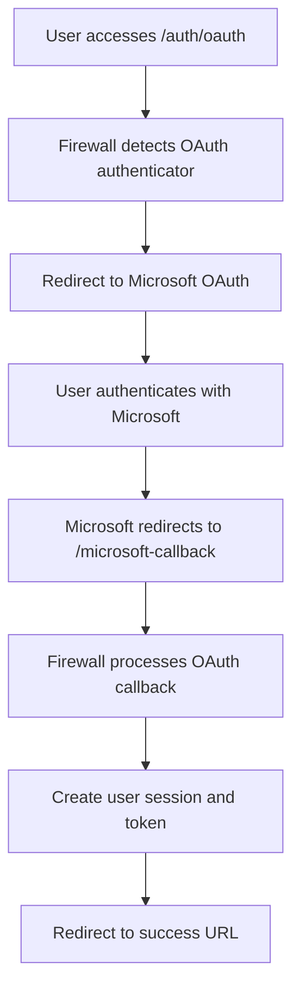

OAuth (Open Authorization) authentication in Framefox provides a comprehensive, enterprise-grade implementation of OAuth 2.0 that prioritizes security without sacrificing developer experience. Unlike traditional authentication methods that require users to share their credentials directly with your application, OAuth enables secure delegation of access through trusted third-party providers like Microsoft, Google, and other services.

The framework's OAuth implementation goes beyond basic compliance to include advanced security features that protect against modern attack vectors. Framefox automatically handles the complex OAuth flow orchestration, token lifecycle management, and security validations that would otherwise require hundreds of lines of custom code.

:::note[OAuth 2.0 Compliance & Security]
Framefox OAuth implementation follows [RFC 6749 (OAuth 2.0)](https://tools.ietf.org/html/rfc6749) and [RFC 7636 (PKCE)](https://tools.ietf.org/html/rfc7636) specifications, with additional security measures recommended by [OAuth 2.0 Security Best Current Practice](https://tools.ietf.org/html/draft-ietf-oauth-security-topics). The framework implements multiple layers of protection including CSRF prevention, authorization code interception protection, and timing attack mitigation.
:::

## Quick Setup with Microsoft OAuth

OAuth authentication setup in Framefox is streamlined through the intelligent CLI command that generates secure, production-ready code:

```bash
framefox create auth
```

The CLI will guide you through a series of questions to configure your OAuth authenticator:

### Step 1: Choose Authenticator Type
```
Choose an authenticator type

1. Form Login (email/password web forms)
2. JWT API (stateless API authentication)
3. OAuth Google (Google Sign-In)
4. OAuth Microsoft (Microsoft/Azure AD)
5. Custom (advanced cases)

Authenticator type [1]: 4
```

### Step 2: Choose Authenticator Name
```
Choose a name for your oauth_microsoft authenticator [default: oauth]

Authenticator name (snake_case) [oauth]: microsoft_oauth
```

### Step 3: Configure OAuth Provider (Optional)
```
Do you want to use a user provider for OAuth authentication?

• With provider: OAuth users will be linked to existing entities
• Without provider: Virtual OAuth users will be created (recommended)

Use a provider? [no]: no

OAuth will use virtual users (no database persistence)
```

## Generated Files Structure

The CLI command creates a complete OAuth implementation with the following files:

### 1. Microsoft OAuth Authenticator
**File:** `src/security/microsoft_oauth_authenticator.py`

This authenticator handles the complete Microsoft OAuth 2.0 flow including Azure AD integration:

```python
class MicrosoftOauthAuthenticator(AbstractOAuthAuthenticator, AuthenticatorInterface):
    oauth_provider_name = "microsoft"
    authorization_endpoint = "https://login.microsoftonline.com/{tenant}/oauth2/v2.0/authorize"
    token_endpoint = "https://login.microsoftonline.com/{tenant}/oauth2/v2.0/token" 
    userinfo_endpoint = "https://graph.microsoft.com/v1.0/me"
    scopes = ["openid", "email", "profile"]
    
    async def authenticate(self, request: Request) -> Optional[Passport]:
        if "code" in request.query_params:
            return await self.handle_oauth_callback(request)
        return None
    
    def on_auth_success(self, token: str) -> RedirectResponse:
        return RedirectResponse(url="/dashboard", status_code=303)
    
    def on_auth_failure(self, request: Request, reason: str = None) -> RedirectResponse:
        if "code" in request.query_params:
            return RedirectResponse(url="/login?error=auth_failed", status_code=303)
        else:
            state = secrets.token_urlsafe(32)
            auth_url = self.get_authorization_url(state)
            return RedirectResponse(url=auth_url, status_code=302)
```

### 2. Security Configuration
**File:** `config/security.yaml` (automatically updated)

The firewall configuration is automatically added to handle OAuth authentication routes:

```yaml
security:
  firewalls:
    microsoft_oauth:
      authenticator: src.security.microsoft_oauth_authenticator:MicrosoftOauthAuthenticator
      login_path: /auth/oauth
      logout_path: /logout
      denied_redirect: /
      oauth:
        client_id: ${MICROSOFT_CLIENT_ID}
        client_secret: ${MICROSOFT_CLIENT_SECRET}
        tenant_id: ${MICROSOFT_TENANT_ID}
        callback_path: /microsoft-callback
        redirect_uri: ${APP_URL}/microsoft-callback
```

### 3. Environment Configuration
**File:** `.env` (you must add these values)

```bash
# Microsoft OAuth Configuration
MICROSOFT_CLIENT_ID=your_azure_application_id
MICROSOFT_CLIENT_SECRET=your_azure_client_secret
MICROSOFT_TENANT_ID=your_azure_tenant_id

# Application URL for OAuth callbacks
APP_URL=http://localhost:8000
```

### 4. Optional Controller (if requested)
**File:** `src/controller/microsoft_oauth_controller.py`

```python
class MicrosoftOauthController(AbstractController):
    @Route("/auth/oauth", "oauth.login", methods=["GET"])
    async def oauth_login(self) -> JSONResponse:
        return JSONResponse({
            "message": "OAuth login initiated", 
            "provider": "microsoft"
        })
    
    @Route("/microsoft-callback", "oauth.callback", methods=["GET"])
    async def oauth_callback(self) -> JSONResponse:
        return JSONResponse({
            "message": "OAuth authentication successful",
            "provider": "microsoft"
        })
```

## Security Firewall Triggering

The OAuth firewall is automatically triggered based on specific path patterns defined in `security.yaml`:

### When the Firewall Activates

1. **Login Path Access**: When a user visits `/auth/oauth`, the firewall detects this is an OAuth login attempt
2. **Callback Processing**: When Microsoft redirects to `/microsoft-callback` with authorization code
3. **Protected Route Access**: When accessing any route requiring authentication

### Firewall Processing Flow



The firewall uses pattern matching on the paths defined in `security.yaml` to determine when to apply OAuth logic. The `login_path` and `oauth.callback_path` patterns are crucial for proper OAuth flow handling.

## Advanced Security Features

### PKCE (Proof Key for Code Exchange)
Framefox implements PKCE by default, generating a cryptographically secure code verifier and challenge for each OAuth request. This prevents authorization code interception attacks.

### State Parameter Validation
Every OAuth request includes a unique state parameter that serves as a CSRF token. Framefox performs timing-safe comparison to validate the returned state parameter.

### Scope Validation
The framework automatically validates that Microsoft grants all requested permissions and compares the scopes returned in the token response against the originally requested scopes.

### OpenID Connect Support
For Microsoft OAuth, Framefox includes nonce verification for ID tokens, providing protection against token replay attacks.

## Microsoft Azure AD Configuration

To use Microsoft OAuth, you need to configure an application in Azure AD:

1. **Register Application**: Create a new app registration in the Azure portal
2. **Configure Redirect URI**: Add `http://localhost:8000/microsoft-callback` for development
3. **API Permissions**: Grant permissions for `openid`, `email`, and `profile`
4. **Client Secret**: Generate a client secret in the "Certificates & secrets" section
5. **Tenant Information**: Note your tenant ID from the app overview

### Multi-tenant Support

For multi-tenant applications, set `MICROSOFT_TENANT_ID=common` to allow users from any Azure AD tenant to authenticate.

## Virtual User Mode

When no provider is configured (recommended approach), Framefox creates virtual OAuth users that don't require database persistence:

- **User ID**: Generated hash based on email
- **User Data**: Email and name from Microsoft Graph
- **Roles**: Default `ROLE_USER` or configurable in security.yaml
- **Session**: Stored in secure session storage
- **No Database**: No user entities created or stored

This approach is ideal for applications that only need OAuth authentication without complex user management.

## Custom OAuth Providers

Beyond Microsoft and Google, Framefox supports any OAuth 2.0 compliant provider. The abstract OAuth authenticator provides hooks for customizing:

- Authorization and token endpoints
- Scope requirements
- User data mapping
- Custom authentication parameters
- Provider-specific validations

To implement a custom provider, extend `AbstractOAuthAuthenticator` and define the provider-specific endpoints and user data retrieval logic.

## External Resources

- [OAuth 2.0 RFC 6749](https://tools.ietf.org/html/rfc6749) - Official OAuth 2.0 specification
- [PKCE RFC 7636](https://tools.ietf.org/html/rfc7636) - Proof Key for Code Exchange specification
- [Microsoft Graph API](https://docs.microsoft.com/en-us/graph/) - Microsoft user data endpoints
- [Azure AD App Registration](https://docs.microsoft.com/en-us/azure/active-directory/develop/quickstart-register-app) - Azure configuration guide
- [OAuth 2.0 Security Best Practices](https://tools.ietf.org/html/draft-ietf-oauth-security-topics) - Security recommendations
